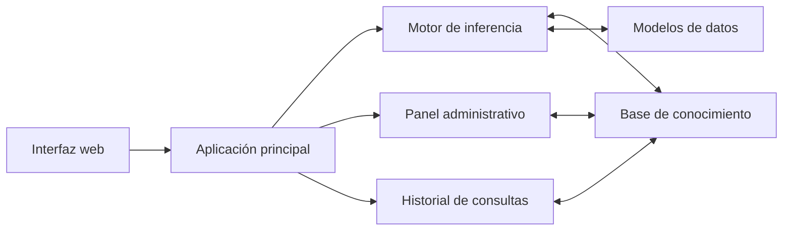
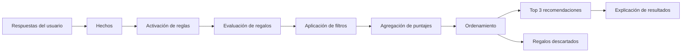

## 📌 Descripción general

El problema que resuelve este proyecto es la dificultad de elegir un regalo apropiado cuando existen muchas variables que deben analizarse al mismo tiempo.

El sistema recibe información proporcionada por el usuario y utiliza conocimiento previamente almacenado para evaluar diferentes opciones de regalo.

# Gift Expert — Versión final corregida

Aplicación completa que conecta una interfaz visual moderna con un motor de inferencia real en **Python + Flask**.

## Solución al problema del `index.html` sin estilos

La versión anterior podía verse como HTML básico cuando se abría `templates/index.html` directamente, porque las rutas de CSS y JavaScript dependían de Flask.

Esta versión incluye:

- `index.html` en la raíz para vista directa con todos los estilos.
- `templates/index.html` para Flask, también con rutas compatibles.
- Detección automática de apertura mediante `file://`.
- Conexión desde el `index.html` directo al backend local en `http://127.0.0.1:5000`.
- Aviso visual claro cuando Python no está iniciado.
- Control de caché para que el navegador no conserve CSS o JavaScript antiguos.

  


## Inicio recomendado en Windows

1. Entra a la carpeta donde esta todo el codigo llamada gift-expert-final-corregido
2. Abre la carpeta `gift-expert-final-corregido`.
3. Haz doble clic en **`EJECUTAR_GIFT_EXPERT.bat`**.
4. si no abre dirigete en la parte superior donde aparece el nombre gift-expert-final-corregido
5. powershell
6. py -3 -m venv .venv
7. .\.venv\Scripts\python.exe -m pip install -r requirements.txt
8. .\.venv\Scripts\python.exe launcher.py
9. Se abrira el sistema experto

```text
http://127.0.0.1:5000
```

Mantén abierta la ventana negra del servidor mientras utilizas la plataforma.

## Inicio manual

```bash
python -m venv .venv
```

Windows:

```bash
.venv\Scripts\activate
```

Linux/macOS:

```bash
source .venv/bin/activate
```

Después:

```bash
python -m pip install -r requirements.txt
python launcher.py
```

## Funciones completas

- Inicio visual profesional y responsive.
- Formulario paso a paso con cinco etapas.
- Validación en vivo en navegador y validación adicional en Python.
- Preguntas de edad, relación, ocasión, urgencia, intereses, personalidad, tipo de regalo, presupuesto y restricciones.
- Motor de inferencia explicable con encadenamiento hacia adelante y reglas ponderadas.
- Filtros estrictos por presupuesto y restricciones.
- Porcentaje de afinidad y explicación de cada conclusión.
- Botones para cambiar presupuesto, ver alternativas y realizar una nueva consulta.
- Historial persistente en JSON.
- Panel administrativo con estadísticas y buscador.
- Recarga de la base de conocimiento sin modificar la lógica.
- Tema claro y oscuro.
- Interfaz adaptable a celular, tableta y computador.
- No utiliza género ni recomendaciones discriminatorias.

## Estructura

```text
gift-expert-final-corregido/
├── index.html                         # Vista directa visual
├── app.py                             # Aplicación Flask y API
├── launcher.py                        # Inicia servidor y navegador
├── motor_inferencia.py                # Motor experto
├── modelos.py                         # Validación y modelo de consulta
├── EJECUTAR_GIFT_EXPERT.bat           # Inicio recomendado para Windows
├── EJECUTAR_GIFT_EXPERT.command       # Inicio para macOS/Linux
├── requirements.txt
├── LEEME_PRIMERO.txt
├── base_conocimiento/
│   ├── configuracion.json
│   ├── regalos.json
│   ├── reglas.json
│   ├── ocasiones.json
│   ├── intereses.json
│   └── historial.json
├── servicios/
│   └── historial.py
├── templates/
│   └── index.html                     # Interfaz servida por Flask
├── static/
│   ├── css/styles.css
│   └── js/app.js
├── tests/
│   ├── test_api.py
│   ├── test_motor.py
│   └── test_frontend.py
└── docs/
    ├── ANALISIS_Y_MOTOR.md
    └── DIAGRAMAS.md
```


## Base de conocimiento editable

Los regalos y las reglas están separados de la lógica principal. Modifica los archivos JSON de `base_conocimiento/` y después pulsa **Recargar base** en el panel de historial.

## Pruebas

```bash
pytest -q
```

Las pruebas verifican el motor, las API, el historial, los recursos CSS/JS y las rutas del `index.html`.


## 📌 Descripción general

El problema que resuelve este proyecto es la dificultad de elegir un regalo apropiado cuando existen muchas variables que deben analizarse al mismo tiempo.

El sistema recibe información proporcionada por el usuario y utiliza conocimiento previamente almacenado para evaluar diferentes opciones de regalo.

### Variables principales de entrada

- Persona para quien se compra el regalo.
- Edad.
- Tipo de relación.
- Nivel de cercanía.
- Ocasión.
- Presupuesto disponible.
- Gustos e intereses.
- Personalidad.
- Tipo de regalo deseado.
- Preferencia entre algo útil, memorable o ambos.
- Necesidad de personalización.
- Restricciones, alergias o preferencias especiales.
- Tiempo disponible para comprar o preparar el regalo.

### Salidas principales

- Tres regalos recomendados.
- Porcentaje o puntuación de afinidad.
- Explicación de cada recomendación.
- Precio estimado.
- Alternativas compatibles.
- Regalos descartados y motivo del descarte.

---

## 🎯 Objetivo del sistema

Desarrollar un sistema experto capaz de recomendar regalos de manera lógica, personalizada y explicable.

El sistema no se limita a mostrar productos. Analiza los datos suministrados por el usuario, aplica reglas de conocimiento, filtra opciones incompatibles y organiza los regalos según su nivel de adecuación.

---

# 🖼️ Explicación de las tres imágenes

Las tres imágenes representan diferentes niveles del proyecto:

| Imagen | Contenido | Propósito |
|---|---|---|
| Imagen 1 | Arquitectura general, interfaz, administración y tecnologías | Presentar el sistema completo |
| Imagen 2 | Motor de preguntas y secuencia de decisión | Mostrar cómo se recopilan los datos |
| Imagen 3 | Red de inferencia, reglas, puntajes, filtros y resultados | Explicar cómo razona el sistema |

---

# 1️⃣ Imagen 1: arquitectura general del sistema


Esta imagen presenta la visión completa del sistema experto.

## 1.1 Análisis breve del problema

El sistema debe escoger el regalo más conveniente según la información del destinatario y las condiciones de compra.

En esta sección se identifican:

- **Problema:** dificultad para seleccionar un regalo adecuado.
- **Variables de entrada:** edad, relación, ocasión, intereses, presupuesto y restricciones.
- **Hechos:** respuestas ingresadas por el usuario.
- **Base de conocimiento:** regalos, categorías, ocasiones, intereses, compatibilidades y reglas.
- **Reglas:** condiciones lógicas de tipo SI–ENTONCES.
- **Método de razonamiento:** encadenamiento hacia adelante.
- **Resolución de conflictos:** prioridad por coincidencia, presupuesto, pertinencia y variedad.
- **Modelo de puntuación:** cálculo de afinidad entre el usuario y cada opción de regalo.

## 1.2 Interfaz del usuario

La interfaz se propone como un formulario paso a paso.

El usuario registra datos como:

- Edad.
- Ocasión.
- Intereses.
- Presupuesto.
- Relación con la persona.
- Preferencias adicionales.

Cuando termina el formulario, el sistema muestra una pantalla de resultados con varias recomendaciones.

Cada recomendación puede incluir:

- Nombre del regalo.
- Imagen.
- Porcentaje de afinidad.
- Precio estimado.
- Categorías asociadas.
- Razón de la recomendación.

## 1.3 Panel de administración

El panel administrativo permite gestionar el conocimiento del sistema.

Funciones propuestas:

- Consultar el historial de recomendaciones.
- Administrar regalos.
- Modificar reglas.
- Editar la base de conocimiento.
- Gestionar usuarios.
- Revisar estadísticas.
- Verificar el estado del sistema.

Este módulo es importante porque permite ampliar o corregir el conocimiento sin modificar toda la aplicación.

## 1.4 Proceso general de inferencia

El flujo presentado en la imagen es el siguiente:

1. El usuario ingresa sus datos.
2. El sistema valida la información.
3. Se convierten las respuestas en hechos.
4. Los hechos se comparan con la base de conocimiento.
5. Se activan las reglas compatibles.
6. Se calcula una puntuación para cada alternativa.
7. Se resuelven conflictos entre opciones.
8. Se genera la recomendación final con explicación.
9. Se guarda la consulta en el historial.

## 1.5 Stack tecnológico propuesto

- **Python:** desarrollo del motor de inferencia.
- **JSON o CSV:** almacenamiento editable de reglas, regalos, intereses y ocasiones.
- **Flask o FastAPI:** conexión entre el motor de inferencia y la interfaz.
- **HTML, CSS y JavaScript:** interfaz web.
- **Base de datos opcional:** almacenamiento de usuarios, consultas e historial.

## 1.6 Componentes principales



---

# 2️⃣ Imagen 2: motor de preguntas


Esta imagen representa el proceso de adquisición de información.

El sistema realiza una secuencia de preguntas para transformar las preferencias del usuario en hechos que puedan ser analizados.

## 2.1 ¿Para quién es el regalo?

Permite establecer el tipo de destinatario:

- Pareja.
- Madre o padre.
- Hijo o hija.
- Hermano o hermana.
- Amigo o amiga.
- Compañero de trabajo.
- Jefe.
- Profesor.
- Niño, adolescente, adulto o adulto mayor.
- Persona que el usuario conoce poco.

Esta respuesta influye en el nivel de formalidad, cercanía y personalización del regalo.

## 2.2 ¿Qué edad tiene?

La edad permite evitar recomendaciones inadecuadas.

Rangos propuestos:

- 0 a 2 años.
- 3 a 5 años.
- 6 a 11 años.
- 12 a 17 años.
- 18 a 25 años.
- 26 a 35 años.
- 36 a 50 años.
- 51 a 64 años.
- 65 años o más.

## 2.3 ¿Cuál es la ocasión?

Ejemplos:

- Cumpleaños.
- Navidad.
- Aniversario.
- Día de la Madre.
- Día del Padre.
- Amor y amistad.
- Graduación.
- Matrimonio.
- Baby shower.
- Agradecimiento.
- Disculpa.
- Sorpresa romántica.
- Sin ocasión especial.

La ocasión modifica la importancia emocional y el tipo de presentación esperada.

## 2.4 ¿Cuál es el presupuesto?

El presupuesto funciona como una restricción obligatoria.

Rangos de ejemplo:

- Menos de $30.000.
- Entre $30.000 y $60.000.
- Entre $60.000 y $100.000.
- Entre $100.000 y $200.000.
- Entre $200.000 y $500.000.
- Entre $500.000 y $1.000.000.
- Más de $1.000.000.

El sistema debe impedir que una recomendación principal supere el valor máximo definido, salvo que se muestre claramente como alternativa.

## 2.5 ¿Qué tipo de regalo busca?

- Material.
- Experiencia.
- Personalizado.
- Tecnológico.
- Práctico.
- Emocional.
- Romántico.
- Educativo.
- Divertido.
- Hecho a mano.
- Tarjeta de regalo.
- Combinado.

## 2.6 ¿Cuáles son sus gustos?

Categorías de interés:

- Tecnología.
- Deportes.
- Música.
- Lectura y aprendizaje.
- Moda y belleza.
- Gastronomía.
- Viajes y experiencias.
- Arte y creatividad.
- Hogar y decoración.
- Mascotas.

Cada gusto puede relacionarse con varios regalos almacenados en la base de conocimiento.

## 2.7 ¿Cómo es su personalidad?

Ejemplos:

- Romántica.
- Divertida.
- Tranquila.
- Aventurera.
- Deportiva.
- Creativa.
- Tecnológica.
- Elegante.
- Práctica.
- Sentimental.
- Intelectual.
- Espiritual.
- Extrovertida.
- Introvertida.
- Minimalista.

## 2.8 ¿Qué tan cercana es la relación?

- Muy cercana.
- Cercana.
- Laboral o formal.
- Poco cercana.
- La persona apenas es conocida.

Esta variable evita recomendar regalos demasiado íntimos en relaciones formales o poco cercanas.

## 2.9 ¿Prefiere algo útil o memorable?

- Útil.
- Memorable.
- Ambos.

## 2.10 ¿Debe ser personalizado?

Opciones posibles:

- Con nombre.
- Con fotografías.
- Con una frase.
- Con una fecha.
- Hecho a mano.
- Convencional.
- Sin preferencia definida.

## 2.11 ¿Existen restricciones?

El sistema debe revisar:

- Alergias.
- Tallas.
- Colores preferidos o rechazados.
- Marcas que deben evitarse.
- Creencias religiosas.
- Restricciones de transporte.
- Tiempo máximo de entrega.
- Productos que la persona ya posee.
- Preferencias excluyentes.

## 2.12 ¿Cuánto tiempo hay disponible?

- Hoy.
- Entre uno y tres días.
- Una semana.
- Varias semanas.
- Se puede esperar por una personalización.

## 2.13 Secuencia lógica de decisión

```mermaid
flowchart LR
    A[Persona] --> B[Edad]
    B --> C[Ocasión]
    C --> D[Presupuesto]
    D --> E[Gustos]
    E --> F[Personalidad]
    F --> G[Tipo de regalo]
    G --> H[Cercanía]
    H --> I[Personalización]
    I --> J[Restricciones]
    J --> K[Tiempo disponible]
    K --> L[Recomendación final]
```



## 2.14 Resultados esperados

La imagen presenta ejemplos de posibles recomendaciones:

- Audífonos inalámbricos personalizados.
- Cena romántica con carta especial.
- Álbum de fotografías familiar.
- Termo elegante con chocolates.
- Camiseta deportiva oficial.
- Libro con agenda personalizada.
- Perfume con accesorio.
- Desayuno sorpresa.
- Tarjeta de regalo.
- Experiencia de viaje o spa.

Estas opciones son ejemplos. La recomendación real depende de los hechos ingresados y de las reglas activadas.

---

# 3️⃣ Imagen 3: red de inferencia


La tercera imagen muestra la lógica interna del sistema.

La red está organizada en cinco grupos principales:

1. Hechos de entrada.
2. Nodos intermedios o reglas.
3. Nodos de evaluación.
4. Nodos de filtrado.
5. Nodo de agregación y salidas.

## 3.1 Hechos de entrada

Los hechos se generan a partir de las respuestas del usuario.

Ejemplo:

```text
persona = "pareja"
edad = 28
ocasion = "aniversario"
presupuesto = 150000
tipo_regalo = "experiencia"
gustos = ["viajes", "gastronomía"]
```

Estos datos son enviados al motor de inferencia.

## 3.2 Nodos intermedios

Los nodos intermedios representan reglas SI–ENTONCES.

Ejemplos incluidos en la red:

- Edad y ocasión.
- Pareja y aniversario.
- Presupuesto bajo.
- Presupuesto alto.
- Interés en tecnología.
- Interés en deportes.
- Regalo para adulto mayor.
- Preferencia por personalización.
- Preferencia por experiencias.
- Relación formal.
- Restricciones especiales.
- Coincidencia total.

Una misma respuesta puede activar varias reglas al mismo tiempo.

## 3.3 Nodos de evaluación

Cada regalo recibe puntajes en diferentes criterios:

- **E1 — Relación:** compatibilidad con el vínculo entre comprador y destinatario.
- **E2 — Ocasión:** adecuación para el evento.
- **E3 — Intereses:** coincidencia con gustos.
- **E4 — Presupuesto:** ajuste al dinero disponible.
- **E5 — Tipo de regalo:** compatibilidad con el formato solicitado.

Cada criterio puede calificarse, por ejemplo, de 0 a 100 puntos.

## 3.4 Nodos de filtrado

Antes de elegir los mejores regalos, el sistema elimina alternativas inválidas.

Filtros representados:

- Conflicto de intereses.
- Restricciones del usuario.
- Presupuesto inválido.
- Falta de disponibilidad.
- Preferencias excluyentes.

Un regalo descartado no debe aparecer dentro de las recomendaciones principales.

## 3.5 Nodo de agregación

El nodo de agregación reúne todas las evaluaciones y calcula una puntuación total.

Una fórmula posible es:

```text
Puntuación total =
(Relación × 0,20) +
(Ocasión × 0,20) +
(Intereses × 0,25) +
(Presupuesto × 0,20) +
(Tipo de regalo × 0,15)
```

Los pesos pueden modificarse según la metodología definida para el proyecto.

La imagen representa una suma total de hasta 500 puntos cuando se utilizan cinco evaluaciones de 0 a 100.

## 3.6 Salidas del sistema

### Regalos recomendados

El sistema organiza las opciones válidas y presenta las tres de mayor puntuación:

1. Primera recomendación.
2. Segunda recomendación.
3. Tercera recomendación.

### Regalos descartados

También puede mostrar alternativas eliminadas por:

- Incumplir restricciones.
- Superar el presupuesto.
- No estar disponibles.
- No ser adecuadas para la ocasión.
- Tener baja afinidad con los intereses.

## 3.7 Flujo completo de inferencia



---

# ⚙️ Funcionamiento del motor de inferencia

El sistema utiliza **encadenamiento hacia adelante**.

Este método comienza con los hechos entregados por el usuario y busca todas las reglas cuyas condiciones se cumplen.

## Etapas

1. Registrar respuestas.
2. Validar campos obligatorios.
3. Convertir respuestas en hechos.
4. Comparar los hechos con las reglas.
5. Activar las reglas compatibles.
6. Asignar puntajes a cada regalo.
7. Aplicar filtros y restricciones.
8. Resolver empates o conflictos.
9. Ordenar las alternativas.
10. Mostrar las mejores recomendaciones.
11. Explicar por qué fueron seleccionadas.
12. Guardar el resultado en el historial.

---

# 🧠 Ejemplos de reglas

## Regla para aniversario de pareja

```text
SI persona = pareja
Y ocasión = aniversario
Y tipo_regalo = experiencia
ENTONCES aumentar puntuación de:
- cena romántica
- viaje de fin de semana
- experiencia de spa
```

## Regla para interés tecnológico

```text
SI gustos contiene tecnología
Y presupuesto >= 100000
ENTONCES aumentar puntuación de:
- audífonos
- reloj inteligente
- accesorios tecnológicos
```

## Regla para presupuesto bajo

```text
SI presupuesto < 60000
ENTONCES priorizar:
- regalos hechos a mano
- cartas personalizadas
- chocolates
- detalles pequeños
```

## Regla para relación formal

```text
SI relación = jefe
O relación = profesor
O cercanía = laboral/formal
ENTONCES evitar regalos demasiado íntimos
Y priorizar regalos elegantes, útiles o profesionales
```

## Regla de restricción

```text
SI alergia = chocolate
ENTONCES descartar todos los regalos que contengan chocolate
```

---

# 🛠️ Tecnologías propuestas

| Tecnología | Función |
|---|---|
| Python | Motor de inferencia y reglas |
| Flask o FastAPI | API y conexión con la interfaz |
| HTML | Estructura de la interfaz |
| CSS | Diseño responsive |
| JavaScript | Interactividad y validaciones |
| JSON o CSV | Base de conocimiento editable |
| SQLite o MySQL | Usuarios, consultas e historial |
| Git y GitHub | Control de versiones |

> Las tecnologías indicadas corresponden a la arquitectura propuesta en las imágenes. Deben ajustarse a la implementación real del proyecto.

---

# 📂 Estructura del proyecto

```text
gift-expert/
│
├── app.py
├── motor_inferencia.py
├── modelos.py
│
├── base_conocimiento/
│   ├── regalos.json
│   ├── reglas.json
│   ├── ocasiones.json
│   ├── intereses.json
│   └── restricciones.json
│
├── templates/
│   ├── index.html
│   ├── formulario.html
│   ├── resultado.html
│   └── administracion.html
│
├── static/
│   ├── css/
│   │   └── estilos.css
│   ├── js/
│   │   └── app.js
│   └── img/
│
├── docs/
│   └── images/
│       ├── 01-arquitectura-general.png
│       ├── 02-motor-de-preguntas.png
│       └── 03-red-de-inferencia.png
│
├── tests/
│   └── test_motor_inferencia.py
│
├── requirements.txt
└── README.md
```

---

# ▶️ Cómo ejecutar el proyecto

Este apartado debe adaptarse cuando el código se encuentre implementado.

Ejemplo para una aplicación desarrollada con Flask:

```bash
# 1. Clonar el repositorio
git clone URL_DEL_REPOSITORIO

# 2. Entrar en la carpeta
cd gift-expert

# 3. Crear un entorno virtual
python -m venv venv

# 4. Activar el entorno virtual en Windows
venv\Scripts\activate

# 5. Instalar dependencias
pip install -r requirements.txt

# 6. Ejecutar la aplicación
python app.py
```

Después, abrir en el navegador:

```text
http://127.0.0.1:5000
```

---

# 🧪 Casos de prueba

## Caso 1: pareja y aniversario

```text
Persona: pareja
Edad: 28 años
Ocasión: aniversario
Presupuesto: $150.000
Gustos: viajes y gastronomía
Tipo: experiencia
```

Resultado esperado:

- Cena romántica.
- Experiencia de spa.
- Actividad o viaje corto dentro del presupuesto.

## Caso 2: adolescente aficionado a la tecnología

```text
Persona: hermano
Edad: 16 años
Ocasión: cumpleaños
Presupuesto: $200.000
Gustos: tecnología y videojuegos
Tipo: tecnológico
```

Resultado esperado:

- Audífonos.
- Accesorio para videojuegos.
- Tarjeta de regalo de una plataforma digital.

## Caso 3: relación laboral formal

```text
Persona: jefe
Edad: 45 años
Ocasión: agradecimiento
Presupuesto: $100.000
Gustos: lectura y café
Cercanía: laboral/formal
```

Resultado esperado:

- Libro.
- Agenda elegante.
- Kit de café.

El sistema debe evitar opciones demasiado personales o románticas.

## Caso 4: presupuesto limitado

```text
Persona: amiga
Edad: 22 años
Ocasión: cumpleaños
Presupuesto: $30.000
Gustos: arte y creatividad
Tipo: memorable
```

Resultado esperado:

- Carta ilustrada.
- Detalle hecho a mano.
- Material artístico pequeño.

## Caso 5: restricción alimentaria

```text
Persona: madre
Edad: 55 años
Ocasión: Día de la Madre
Presupuesto: $120.000
Gustos: bienestar y hogar
Restricción: alergia al chocolate
```

Resultado esperado:

- Planta decorativa.
- Kit de bienestar.
- Elemento para el hogar.

El sistema debe descartar chocolates y productos que contengan el ingrediente restringido.

---

# ✅ Requisitos de calidad

- Código modular y comentado.
- Reglas sin duplicados.
- Validación de todos los datos.
- Base de conocimiento editable.
- Explicación de cada recomendación.
- Manejo de errores.
- Historial de consultas.
- Interfaz responsive.
- Recomendaciones no discriminatorias.
- Separación entre lógica, datos e interfaz.
- Pruebas del motor de inferencia.

---

# 🔒 Consideraciones éticas

El sistema no debe recomendar regalos basándose en estereotipos de género, edad, profesión o condición social.

Las decisiones deben fundamentarse en:

- Gustos declarados.
- Necesidades reales.
- Presupuesto.
- Ocasión.
- Tipo de relación.
- Restricciones.
- Preferencias expresadas por el usuario.

---

# 📊 Resultado esperado del proyecto

Al finalizar, el sistema debe ser capaz de:

1. Formular preguntas relevantes.
2. Transformar respuestas en hechos.
3. Aplicar reglas de conocimiento.
4. Evaluar múltiples alternativas.
5. Eliminar regalos incompatibles.
6. Calcular puntuaciones de afinidad.
7. Presentar las tres mejores opciones.
8. Explicar el razonamiento utilizado.
9. Permitir la edición de reglas y regalos.
10. Mantener un historial de consultas.

---

# 📝 Conclusión

Las tres imágenes describen el sistema desde perspectivas complementarias.

- La primera presenta la arquitectura completa y sus módulos.
- La segunda explica cómo el sistema obtiene la información mediante preguntas.
- La tercera muestra cómo los hechos se convierten en recomendaciones mediante reglas, evaluaciones, filtros y agregación de puntajes.

En conjunto, representan una solución organizada para construir un sistema experto explicable, escalable y orientado a recomendar el regalo más adecuado para cada persona y ocasión.

---

## 👤 Autor

**Juan David Castañeda**

Proyecto académico de Sistemas Expertos.
