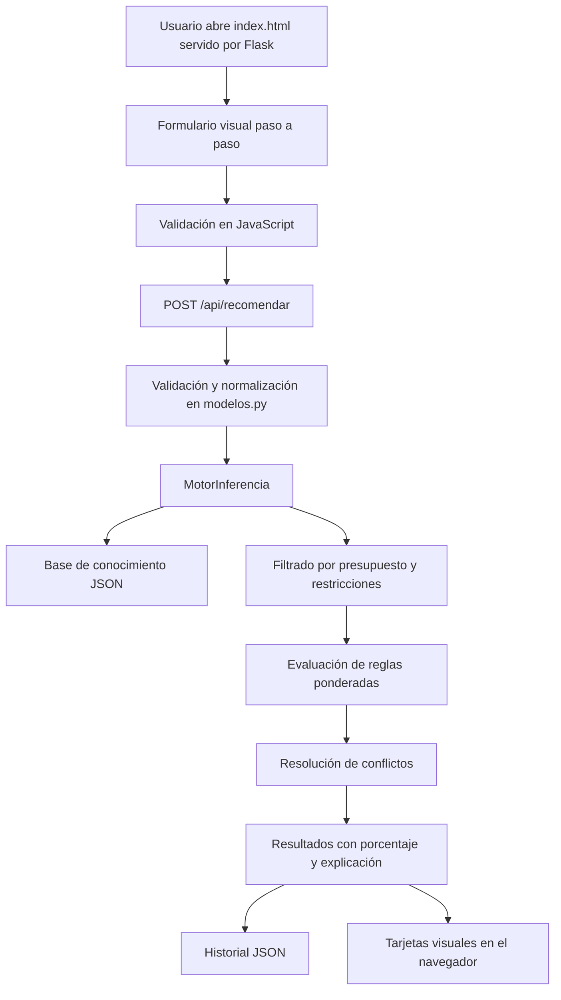
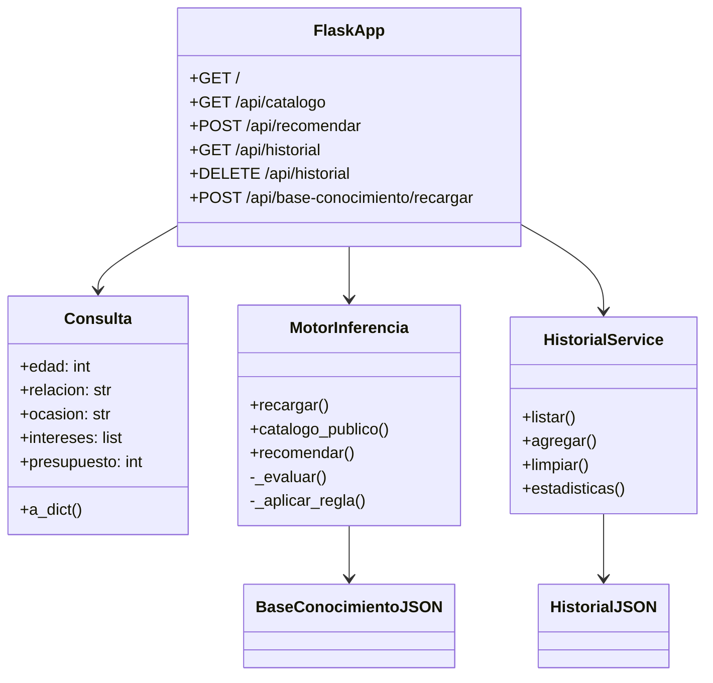

# Diagramas

## Flujo de funcionamiento

```mermaid
flowchart TD
    A[Usuario abre index.html servido por Flask] --> B[Formulario visual paso a paso]
    B --> C[Validación en JavaScript]
    C --> D[POST /api/recomendar]
    D --> E[Validación y normalización en modelos.py]
    E --> F[MotorInferencia]
    F --> G[Base de conocimiento JSON]
    F --> H[Filtrado por presupuesto y restricciones]
    H --> I[Evaluación de reglas ponderadas]
    I --> J[Resolución de conflictos]
    J --> K[Resultados con porcentaje y explicación]
    K --> L[Historial JSON]
    K --> M[Tarjetas visuales en el navegador]
```

## Componentes

```mermaid
classDiagram
    class FlaskApp {
      +GET /
      +GET /api/catalogo
      +POST /api/recomendar
      +GET /api/historial
      +DELETE /api/historial
      +POST /api/base-conocimiento/recargar
    }
    class Consulta {
      +edad: int
      +relacion: str
      +ocasion: str
      +intereses: list
      +presupuesto: int
      +a_dict()
    }
    class MotorInferencia {
      +recargar()
      +catalogo_publico()
      +recomendar()
      -_evaluar()
      -_aplicar_regla()
    }
    class HistorialService {
      +listar()
      +agregar()
      +limpiar()
      +estadisticas()
    }
    FlaskApp --> Consulta
    FlaskApp --> MotorInferencia
    FlaskApp --> HistorialService
    MotorInferencia --> BaseConocimientoJSON
    HistorialService --> HistorialJSON
```
